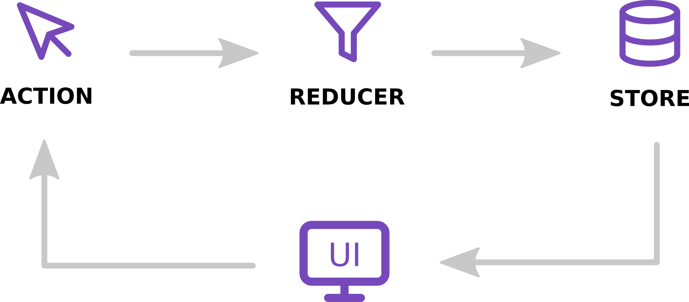

# Redux Concepts

## First Principle

_"The state of your whole application is stored in an object tree within a single store"_

#### Maintain our application state in a single object which would be managed by the Redux store

## Second Principle

_"The only way to change the state is to emit an action, an object describing what happened"_

#### To update the state of your app, you need to let Redux know about that with an action.

Not allowed to directly update the state object

## Three Principle

_"To specify how the state tree is transformed by actions, you write pure reducers_

#### Reducer - (prevState, action) => newState

Reducers - specify how the app´s state changes in response to actions sent to hte store
Function that accepts state and action as arguments, and returns the next state of the application
